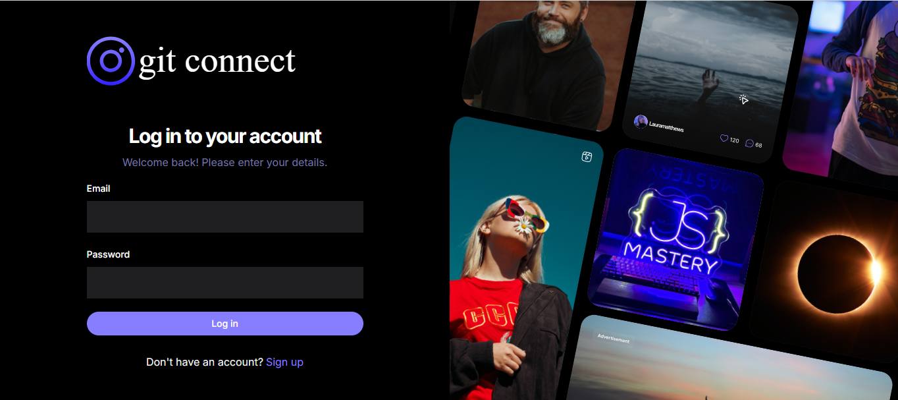

# GitConnect

## NextJS Social Network for Developers

GitConnect allows developers to create a developer profile/portfolio, share posts, and get help from other developers.

## Table of Contents

- [Main Features](#main-features)
- [Requirements (Tech Stack)](#requirements-tech-stack)
- [Live Demo](#live-demo)

## Main Features

Your task is to complete the GitConnect application by adding the following features:

- **Sign Up and Sign In**: Users can create accounts and log in to access their profiles.
- **List All Registered Developers**: A public list displaying all registered developers.
- **Developer Profile Page**: Each profile contains:
  - Personal details
  - Education
  - Work experience
  - GitHub repositories
- **Edit Profile**: Users can update their personal information.
- **Post Management**: Users can view, add, delete, and like/dislike posts.
- **Comments and Discussions**: Users can comment on posts, view the number of likes and dislikes, and discuss posts.

### Public Access
The following can be accessed publicly:
- List of all registered developers
- Profiles of each developer

## Requirements (Tech Stack)

- **Next.js**
- **TypeScript**
- **Appwrite** for backend
- **TailwindCSS**

## Live Demo

You can view the live application at: [GitConnect Live](https://git-connect-6bro.vercel.app/)
